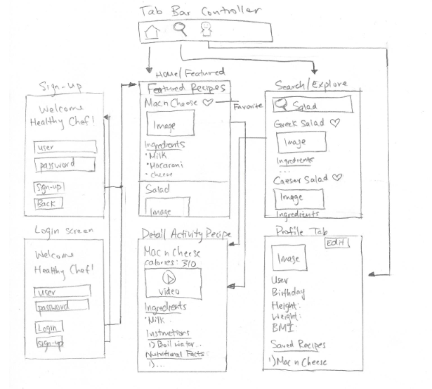

# Healthy Chef

## Table of Contents
1. [Overview](#Overview)
1. [Product Spec](#Product-Spec)
1. [Wireframes](#Wireframes)
2. [Schema](#Schema)

## Overview
The app allows users to browse through a list of cooking recipes to find the one fit for their diet. 
### Description

### App Evaluation
- **Category**: Cooking/ Dietary
- **Mobile**: This app would be primarily developed for mobile as it is more convenient and appropriate for those cooking.
- **Story**: For users who love to eat but are concerned about their diet.
- **Market**: Any individual can use this app, teenagers or adults.
- **Habit**: This app can be used at least once or three times a day for cooking purposes. 
- **Scope**: The user must create an account and answer several questions based on their health for their profile page. The user's height and weight can determine their Body Mass Index.

## Product Spec
### 1. User Stories (Required and Optional)
**Required Must-have Stories**
* A user login and sign up screen.
* A main acivity page consisting of featured recipes.
* Detail activity for the recipes, its nutritional facts, and possibly a cooking video.
* Explore tab to search for a specific recipe
* A profile page with name, username, birthday, weight, height, calculated BMI, and saved/favorited recipes.

**Optional Nice-to-have Stories**
* A nice background theme for the activities.
* Detail activity that includes a cooking video for different recipes.

### 2. Screen Archetypes
* Login - using parse oauth?
* Register - user can sign up
* Featured Recipes Tab
    * Displays recipe name
    * Shows picture of cooked dish
    * List of ingredients 
* Detail Activity of Recipe Screen
    * Includes the recipe name, total calories, a list of ingredients, preparation instructions, possible a video
* Explore Tab 
    * Includes a search bar and recent searches for certain recipes
* Profile Screen Tab
    * Includes user's information, saved/favorite recipes, etc

### 3. Navigation

**Tab Navigation** (Tab to Screen)
* Featured Recipes tab
* Explore/Search tab
* Profile tab

**Flow Navigation** (Screen to Screen)
* Login -> Register (making new account)
* Login -> Featured Recipes Tab (if login successful)
* Register -> Featured Recipes Tab (if register successful)
* Featured Recipes Tab -> Detail Activity of Recipe Screen
* Explore/Search Tab -> Detail Activity of Recipe Screen
* Profile Screen Tab -> Text fields to be modified by questions

## Wireframes

 

## Schema
#### Recipe

| Property     | Type     | Description |
| --------     | -------- | -------- |
| objectId     | Number   | unique id for each recipe  |
| author       | String   | author that created the recipe |
| image        | File     | image of the recipe |
| title        | String   | name of the recipe |
| ingredients  | String   | ingredients of the recipe |
| isSaved      | Boolean  | favorite recipe saved by user |

#### User

| Property     | Type      | Description        |
| --------     | ------    | -----------        |
| Username     | String    | userame for each id|
| password     | Char/Array| unique password    |
| DOB          | Date      | MM/dd/yyyy         |
| Height       | Double    | height of the user |
| Weight       | Double    | weight of the user |
| Profile image| File      | image of the user  |

### Networking
#### List of Networking requests by screen
* Login Screen
    * (Create/POST) Create a new account using Parse server
    * (Read/GET) Query logged in 
* Home Screen
    * (Read/Get) Query random recipes from spoonacular API

* Profile Screen
    * (Read/GET) Query logged in user object
    * (Update/PUT) Update user profile image
